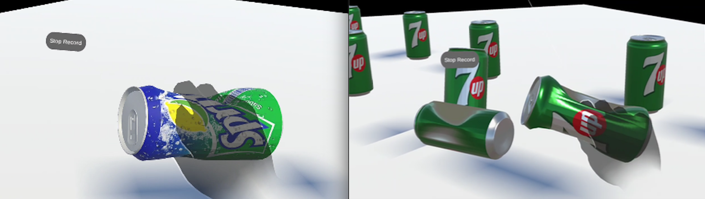
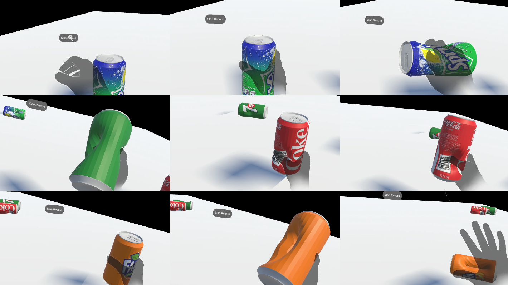
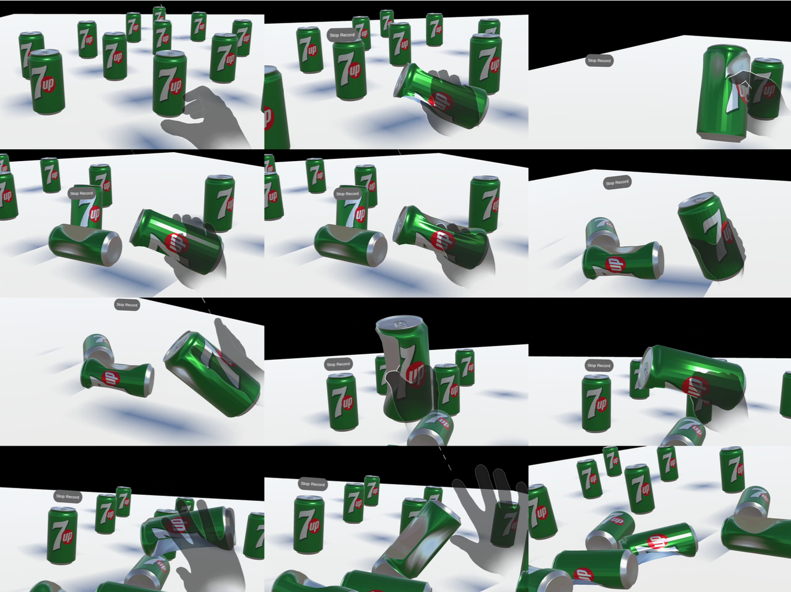
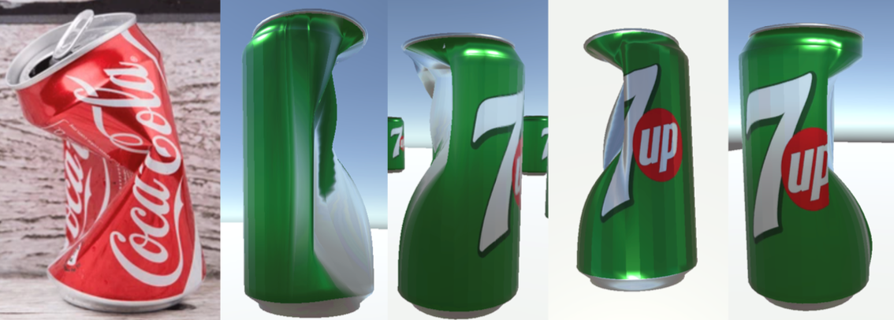

# AR-AluminumCan-Crush-Simulation

A perceptually driven framework for hand-motion-based faceted plastic deformation in smart glasses. Real-time AR aluminum can crushing simulation using hand tracking on XREAL Air 2 Ultra glasses.



---

## Overview

This repository provides the source code for a hand-tracking-based mesh deformation framework that enables real-time representation of plastic and thin can-like object deformation in smart-glass environments.

The framework converts finger-curl variations and pinch-distance changes obtained from hand tracking into continuous input intensities, and generates local object deformation based on the user's contact position and grip direction.

The project evolved through two architectural generations:

**Version 1 — Gaussian CPU Mesh Deformation** (`MeshDeformation/`): Direct CPU-side vertex displacement using a Gaussian falloff function. Produces smooth, stable local indentation around contact points. Simple to implement but causes CPU–GPU data transfer bottlenecks at scale and cannot represent the flattened facets and fold lines of real crushed cans.

**Version 2 — GPU Faceted Crush Solver** (`VertexShader/`): Compact crush-zone parameters computed from hand tracking are transferred to a GPU vertex shader, where a cross-sectional crush function evaluates fold-line angle, facet depth, and shader-side normal correction per vertex. Generates flattened facet regions and sharp fold-line transitions resembling real can deformation, with near-zero CPU overhead.

---

## Pipeline

The system operates through a two-stage architecture split between CPU-side hand-motion analysis and GPU-side vertex deformation.

### Version 1 — Gaussian CPU Mesh Deformation

**Step 1 - Hand-Motion Input (CPU)**
Finger-curl values and pinch distance are collected from the OpenXR hand-tracking runtime each frame and normalized into a continuous input intensity *s* ∈ [0, 1].

**Step 2 - Contact Detection (CPU)**
Fingertip positions are tested against the can collider. Contact points are resolved via `MeshCollider.Raycast` to extract surface position and UV coordinates.

**Step 3 - Gaussian Vertex Displacement (CPU)**
Each vertex near the contact point is displaced inward along its surface normal using a Gaussian falloff weight. The full `mesh.vertices` array is updated and `RecalculateNormals()` is called every frame.

### Version 2 — GPU Faceted Crush Solver

**Step 1 - Intensity Computation (CPU)**
Finger-curl delta and pinch-distance delta are normalized into per-finger input intensities and aggregated into a single severity value.

**Step 2 - Grip-Aware Direction Estimation (CPU)**
Thumb and finger contact positions are transformed into the object's local coordinate frame. The thumb direction θ_thumb is computed directly; the finger-side representative direction θ_finger is computed using a circular mean to avoid angular wraparound.

**Step 3 - Crush-Zone Parameter Construction (CPU)**
Each grip is encoded as two Vector4 crush zones — one for the thumb side and one for the finger side — containing compression direction, axial position, intensity, and influence range. Up to 8 slots are uploaded to the shader as uniforms each frame.

**Step 4 - Faceted Vertex Deformation (GPU)**
The vertex shader computes cylindrical coordinates for each vertex and evaluates the cross-sectional crush function: input intensity → normalized depth δ → fold-line angle α → facet depth h_f. Axial Gaussian falloff and a cap mask localize deformation around the contact position.

**Step 5 - Shader-Side Normal Correction (GPU)**
The angular derivative of the displacement function is approximated using central differences and used to correct each vertex normal, producing sharp lighting changes around fold lines without modifying mesh topology.

---

## Features

**Version 1 (MeshDeformation)**
- Gaussian falloff-based local indentation around contact points
- CPU vertex array update with `RecalculateNormals()`
- Plastic-like deformation accumulation with `Dmax` saturation
- Multi-object support via runtime mesh instancing
- Grab detection with side-grip and top-grip modes
- Deformation reset with full state restoration

**Version 2 (VertexShader)**
- GPU vertex shader deformation — zero CPU mesh modification per frame
- Cross-sectional crush function: flattened facets + fold-line transitions
- Shader-side normal correction using angular derivative of displacement
- Grip-aware compression direction estimation (thumb vs. fingers, circular mean)
- Up to 4 simultaneous independent grip zones (8 crush slots total)
- Validated in real time on XREAL Air 2 Ultra + XREAL Beam Pro

---

## Repository Structure

**MeshDeformation/** — Version 1: CPU-based Gaussian deformation

Core: AluminumCanSimulation.cs is the main simulation controller. CanMesh.cs manages the runtime mesh and buckle regions. BucklingAnimator.cs handles the animated deformation coroutine.

HandTracking: MRTKHandAdapter.cs handles OpenXR joint detection and curl computation. HandState.cs defines the hand data structure. HandCanContactDetector.cs detects finger-to-can contact. GripPatternRecognizer.cs classifies grip types.

Interaction: CanGrabSystem.cs manages grab and release with physics. CanResetManager.cs handles per-object reset. ResetAllCans.cs performs scene-wide reset.

Debug: SimpleDebugDisplay.cs provides the on-device AR debug overlay.

**VertexShader/** — Version 2: GPU faceted crush solver

Core: AluminumCanSimulation.cs is the main controller with UV-extraction support. CanNormalMapDeformer.cs manages crush zones and pushes parameters to the shader.

Shaders: CanCrushShader.shader implements the cross-sectional crush function and shader-side normal correction.

HandTracking: Same components as Version 1. HandCanContactDetector.cs is extended to support UV extraction via MeshCollider.Raycast.

Interaction: CanGrabSystem.cs manages grab and release with physics.

Debug: SimpleDebugDisplay.cs provides the on-device AR debug overlay.

---

## Requirements

| Component | Version |
|-----------|---------|
| Unity | 2022.3.35f1 (Built-in Render Pipeline) |
| XREAL SDK | 3.0.0 |
| MRTK3 | Mixed Reality Toolkit 3 |
| Target Platform | Android (XREAL Beam Pro) |
| Display | XREAL Air 2 Ultra (optical see-through) |
| Hand Tracking | OpenXR Hand Tracking |

---

## Installation

1. Clone this repository.
2. Open Unity Hub and add a new project. Use Unity 2022.3.35f1 with Built-in Render Pipeline.
3. Import MRTK3 and XREAL SDK 3.0.0 into the project.
4. Copy the scripts from `MeshDeformation/` or `VertexShader/` into your project's `Assets/` folder.
5. For the vertex shader version, register `Custom/CanCrushShader` in **Project Settings → Graphics → Always Included Shaders** to ensure it survives Android builds.
6. Attach the scripts to your can GameObject according to the component dependencies below.
7. Build and deploy to XREAL Beam Pro.

### Component Setup (VertexShader version)

The can GameObject requires the following components:
- `MeshFilter` + `MeshRenderer` + `MeshCollider`
- `Rigidbody`
- `AluminumCanSimulation` (assign `MRTKHandAdapter` and original mesh asset)
- `CanGrabSystem`
- `CanNormalMapDeformer` (added automatically via `AddComponent` at runtime)

### 3D Model Note

The aluminum can 3D model is not included in this repository due to licensing restrictions. Any cylindrical mesh with proper UV mapping (UV.y range approximately −0.233 to 0.362 for this implementation) can be used.

---

## Key Implementation Notes

**UV Coordinate Remapping (VertexShader)**
The can model uses a non-standard UV range. Before passing UV.y to the deformation system, normalize it:
```csharp
const float UV_MIN = -0.233f;
const float UV_MAX = 0.362f;
float height = Mathf.Clamp01((uv.y - UV_MIN) / (UV_MAX - UV_MIN));
```

**Scale Mismatch**
The can's local scale (~0.04684) means world-space and object-space values differ significantly. All deformation radius and depth comparisons must account for `lossyScale`.

**Shader Registration**
Custom shaders must be registered in Project Settings → Graphics → Always Included Shaders to survive XREAL device builds.

**Editor Testing**
MRTK editor simulation uses the right hand for contact detection. Test grab and deformation using the right hand in Play Mode.

---

## Results

### Version 1 — Gaussian-based Deformation

The baseline Gaussian model produces stable smooth local indentation in real time. Changes in hand motion are immediately reflected per frame, and similar deformation shapes are repeatedly produced under the same interaction conditions. However, the deformation shape is generally smooth and curved — flattened compressed regions and sharp fold lines observed in real thin cans cannot be represented.



### Version 2 — Faceted Crush Solver

The extended solver generates flattened facet regions and sharp fold-line transitions depending on contact position, input intensity, and grip direction. Grip-aware compression direction estimation produces asymmetric deformation from both thumb and finger sides simultaneously, closer to real grasping behavior.



### Comparison: Real vs. Virtual

Different crush patterns are generated depending on the user's finger contact position and input intensity — narrow-waist compression, asymmetric side collapse, and twisted faceted deformation. The proposed solver produces visually plausible can-like deformation patterns in real time while reflecting variations in user interaction.



---


